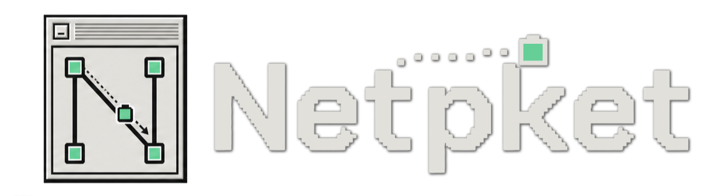
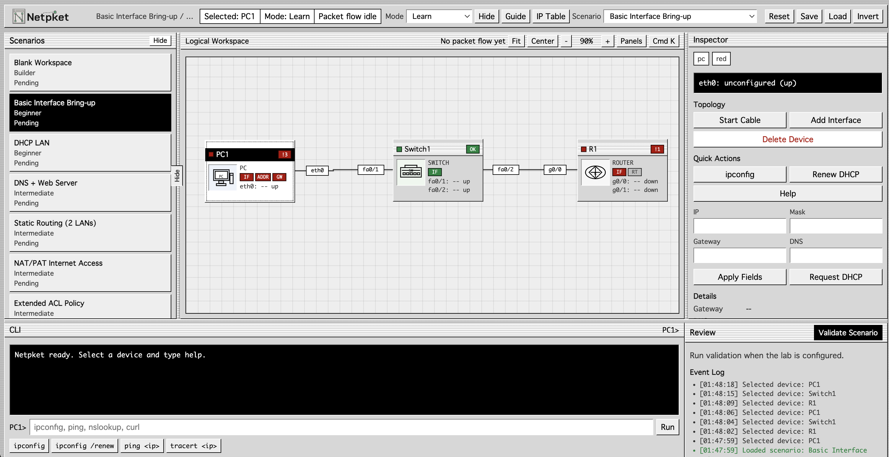

<div align="center">



**A browser-based networking learning lab with a deterministic simulator, IOS-like CLI, and a retro workbench UI.**

[Getting Started](#getting-started) &middot; [Architecture](#architecture--technical-decisions) &middot; [Scenarios](#scenario-walkthrough) &middot; [Tech Stack](#tech-stack)

</div>

<br />

<p align="center">
  
</p>

---

## The Problem

Learning networking means wrestling with two things at once: the **concepts** (subnetting, routing, ACLs, NAT) and the **tools** (simulators with hidden state, inconsistent CLI autocomplete, and opaque failure reasons). Cisco Packet Tracer is powerful, but it buries why a packet failed behind broad simulation events and mode-heavy menus. Beginners can't answer the four questions that matter:

1. What am I trying to fix?
2. What is currently wrong?
3. Which device or command caused that state?
4. What should I test next?

## The Solution

**Netpket** is a self-contained networking lab that runs entirely in the browser. It pairs a deterministic packet-flow simulator with an inspectable, System 7-inspired workbench that exposes every routing decision, ACL match, DNS resolution, and NAT translation directly to the learner.

No accounts. No install. No server. Open the page and start configuring.

```
 Zero external UI dependencies  |  Deterministic simulator  |  Structured packet diagnostics
```

---

## Key Features

### Simulator & Protocols

- **Deterministic networking engine** — Full packet-flow simulation with routing, DHCP, DNS, NAT/PAT, extended ACLs, static routes, RIP/EIGRP dynamic routing, and QoS class/policy maps. Given a `LabState` and a command, the simulator produces the next state with no side effects or randomness.
- **Structured packet diagnostics** — Every `ping`, `traceroute`, `nslookup`, and `curl` produces `FlowStep` records tracing each hop, ACL match, NAT translation, and routing decision. Failures point to the exact device, interface, or rule that caused the drop.
- **Animated packet-flow visualization** — Visual animation showing packet paths across the topology with success/block indicators at each hop.

### IOS-like CLI

- **8-mode state machine** — `user` → `privileged` → `config` → `interface` / `dhcp` / `acl` / `routing` / `class-map` / `policy-map` with mode-aware validation.
- **`?` suggestions and Tab completion** — Context-aware command suggestions and auto-completion.
- **Multi-command paste** — Paste or type multiple commands separated by newlines; all execute in sequence.
- **Colored terminal output** — Red errors, green success, blue help text, and differentiated command echo.
- **Error recovery hints** — Mode-specific suggestions after invalid commands (e.g. "You are in user mode. Try `en` first.").
- **Command history** — Navigate previous commands with Up/Down arrow keys.
- **`clear` / `cls`** — Terminal clearing support.
- **Abbreviated commands** — `en`, `conf t`, `int g0/0`, `sh ip route`, etc.

### Topology & Workspace

- **Topology Recipe Builder** — Generate multi-router topologies from a compact address pattern like `15+1.38.47.1/30`. Auto-provisions interfaces, cabling, switches, PCs, and baseline IPs.
- **Address pattern preview** — Shows generated subnets and host addresses in a preview table before applying.
- **Blank workspace mode** — Free-form topology creation with no seed config.
- **Right-click canvas device creation** — Context menu to add routers, switches, PCs, servers, and cloud devices anywhere on the canvas.
- **Manual cabling** — Start cable mode, click source device, click target device; auto-assigns interfaces on both ends.
- **Device drag-and-drop** — Freely position devices on the workspace canvas.
- **Orthogonal cable routing** — Links route with clean bends; endpoint-near labels show interface names and IPs.
- **Zoom, pan, fit, center** — Zoom 55%–160%, drag to pan, fit-all, and center controls.
- **Resizable/collapsible panel layout** — Left (scenarios), right (inspector), bottom (terminal) panels with draggable splitters. Collapse any panel to expand the workspace.
- **Device and cable deletion** — Remove devices and their connected cables, or delete individual links.

### Inspector & Status

- **Device problem badges** — Count of configuration issues displayed on each device icon in the workspace.
- **Service status lamps** — Visual indicators for DHCP, DNS, HTTP, MAIL, NAT, ACL, and route state per device.
- **Clickable link inspection** — Click any cable to open the inspector with both endpoints and pre-filled `show` commands.
- **Validation fix-hint rows** — Each failed validation check selects the relevant device and prepares a useful CLI command.
- **Quick actions** — Device-specific buttons: `ipconfig`, `ping`, `nslookup`, `curl`, `show interfaces`, `show ip route`, `show running-config interface`, `show interfaces description`.
- **Route table, NAT translations, ACL inspection** — Full visibility into router state from the inspector panel.
- **Server service management** — Toggle DHCP pools, DNS records, HTTP content, and MAIL mailboxes on servers.
- **IP table popup** — Quick-reference subnet calculation table (network, broadcast, host range, available hosts per prefix).

### Keyboard & Navigation

- **Command palette** (`Cmd+K` / `Ctrl+K`) — Searchable quick actions: device selection, validation, workspace fitting, CLI hint filling, domain-specific `nslookup`/`curl`.
- **Scenario shortcuts** (`Alt+1`–`Alt+9`) — Jump directly to any scenario.
- **Validate shortcut** (`Ctrl+Enter` / `Cmd+Enter`) — Run validation from anywhere.
- **Escape** — Close menus, dismiss cable mode, close palette, or focus the CLI input.
- **Tab** — Auto-complete the current CLI command.
- **Arrow keys** — Navigate command history (Up/Down).

### Learning & Progression

- **7 progressive scenarios + blank workspace + recipe builder** — From basic interface bring-up through DHCP, DNS, static routing, NAT/PAT, ACL policy, to a multi-issue troubleshooting challenge.
- **Per-scenario objectives** — Numbered, trackable objectives with done/active/idle states and a score percentage.
- **Validation engine** — Checks interface state, IP addressing, gateway, DHCP, DNS, routes, NAT, ACL rules, and end-to-end connectivity. Returns pass/fix results.
- **First-run guide** — Four-step onboarding dialog (choose scenario → configure devices → test connectivity → validate) shown once, re-openable via Guide button.
- **Event log** — Timestamped history of all actions (commands, state changes, test results).

### Persistence & Theming

- **Full state persistence** — Lab state, selected device, active scenario, panel sizes, and viewport saved to `localStorage`. Resume exactly where you left off.
- **Session persistence** — Remembers guide dismissed state and first-run completion.
- **Theme toggle** — Platinum (classic light) and Invert (dark) themes.

---

## Architecture & Technical Decisions

### Deterministic Simulator

The simulator (`src/lib/simulator.ts`) is a pure function engine — given a `LabState` and a command, it produces the next `LabState` with no side effects or randomness. This makes every lab reproducible and every packet trace inspectable.

The core processes:
- **Route lookup** — longest-prefix match across connected, static, and dynamic (RIP/EIGRP) routes
- **ACL evaluation** — sequential rule matching with wildcard mask comparison and implicit deny
- **NAT/PAT translation** — inside/outside role resolution, ACL-referenced overload rules, per-translation port mapping
- **DNS resolution** — server reachability check, record lookup, and follow-up connection to resolved IP
- **DHCP lease lifecycle** — pool matching, excluded-range validation, default-router/DNS delivery, and client binding

All connectivity results include structured `FlowStep` records — not just pass/fail text — so the UI can highlight the exact device, interface, route, or ACL rule that caused a drop.

### IOS-like CLI Parser

The CLI (`src/lib/cli.ts`) implements a state machine across 8 modes:

```
user → privileged → config → interface / dhcp / acl / routing / class-map / policy-map
```

It handles abbreviated commands (`en`, `conf t`, `int g0/0`), validates arguments (IP, mask, interface names), manages mode-specific context (current interface, current ACL), and produces both terminal output and state mutations. The parser is mode-aware — commands valid in `config` mode are rejected in `user` mode with helpful context about what to do next.

### System 7 UI Philosophy

The interface (`src/styles.css`, `src/App.tsx`) draws from Mac OS Platinum / System 7: platinum gray windows, 1px borders, striped title bars, dense controls, and square corners. This isn't nostalgia for its own sake — it's a deliberate design choice:

- **Dense information layout** — panels pack controls, status, and diagnostics without decorative whitespace
- **Inspectable state** — service lamps, problem badges, and fix-hint rows expose simulator internals directly
- **Workbench, not dashboard** — the learner sees scenario objectives, topology, device inspector, and terminal simultaneously
- **Progressive disclosure** — collapsible panels, tabbed inspector sections, and hint levels prevent information overload

### Zero-Dependency UI

The entire UI is built with **React 19 + vanilla CSS**. No component library, no CSS framework, no design system package. The workbench layout is a single 2,300-line `App.tsx` that manages resizable panels, a zoomable/pannable canvas, device drag-and-drop, orthogonal cable routing, and terminal interaction — all with native browser APIs.

This keeps the bundle minimal, the rendering pipeline transparent, and the design space unconstrained by third-party component APIs.

---

## Scenario Walkthrough

Seven progressive labs take the learner from first interface bring-up to multi-protocol troubleshooting.

| # | Scenario | Difficulty | Protocols |
|---|----------|-----------|-----------|
| 0 | **Blank Workspace** | Builder | Free-form topology creation with right-click device placement and manual cabling |
| 1 | **Basic Interface Bring-up** | Beginner | IP addressing, `no shutdown`, gateway, end-to-end ping |
| 2 | **DHCP LAN** | Beginner | DHCP pool, excluded ranges, lease renewal |
| 3 | **DNS + Web Server** | Intermediate | DNS records, `nslookup`, HTTP service, `curl` |
| 4 | **Static Routing (2 LANs)** | Intermediate | Transit network, reciprocal static routes, multi-hop ping |
| 5 | **NAT/PAT Internet Access** | Intermediate | Inside/outside roles, ACL-based PAT overload, public server access |
| 6 | **Extended ACL Policy** | Intermediate | Ordered ACL rules, wildcard masks, permit/deny by protocol and port |
| 7 | **Troubleshooting Office** | Challenge | Shutdown transit, wrong gateway, bad DHCP pool, missing route, overbroad ACL |
| 8 | **Recipe Builder Lab** | Builder | Address pattern generation, auto-provisioned topology, gateway validation |

Each scenario includes a `why` explaining the learning purpose, clear objectives, and validation checks that produce pass/fix results with device-specific fix hints.

---

## Tech Stack

| Layer | Technology | Purpose |
|-------|-----------|---------|
| Framework | React 19 | Component model, hooks, concurrent features |
| Language | TypeScript 5.9 | Static types across simulator, CLI, and UI |
| Build | Vite 7 | Dev server, HMR, production bundling |
| Testing | Playwright | Smoke coverage across all 7 scenarios |
| UI | Vanilla CSS | System 7-inspired workbench (no external UI library) |
| State | React `useState` | Local persistence via `localStorage` |

**Runtime dependencies: `react`, `react-dom`.** That's it.

---

## Getting Started

```bash
# Install dependencies
npm install

# Start dev server (http://127.0.0.1:5173)
npm run dev

# Production build
npm run build

# Run smoke tests across all scenarios
npm run smoke
```

---

## Project Structure

```
src/
  App.tsx                  App shell: workspace, inspector, terminal, validation, persistence
  main.tsx                 Entry point
  styles.css               System 7-inspired chrome and responsive layout
  types.ts                 Shared TypeScript interfaces (Device, LabState, Link, etc.)
  data/
    scenarios.ts           8 lab topologies, objectives, and seed configurations
  lib/
    simulator.ts           Deterministic networking model (routing, DHCP, DNS, NAT, ACL, QoS)
    cli.ts                 IOS-like command parser (8 CLI modes, abbreviations, suggestions)
    validation.ts          Scenario completion checks with fix hints
    topologyRecipe.ts      Address pattern parser and topology generator
    ip.ts                  Subnet math helpers (network address, host range, mask conversion)
scripts/
  smoke.mjs                Playwright E2E smoke coverage for all scenarios
public/
  brand/                   Logo assets
```

**~7,700 lines** of application code across 10 source files.

---

## Testing & Quality

`npm run smoke` launches a Playwright-driven E2E suite that verifies:

- App render, logo display, first-run guide flow
- All 7 scenario switches and their topology rendering
- CLI configuration across user, privileged, config, and interface modes
- Multi-command paste and colored terminal output
- CLI error recovery hints
- Scenario validation (pass and intentional-fail paths)
- NAT/PAT translation and ACL policy enforcement
- DHCP lease renewal and DNS resolution
- HTTP `curl` end-to-end
- Topology recipe generation and address pattern preview
- Packet-flow animation and orthogonal cable rendering
- Service lamps, problem badges, and clickable link inspection
- Command palette behavior
- Collapsible/resizable panel layout
- Negative ACL-order path validation
- Mobile viewport rendering

Interaction paths that trigger large state updates yield to the browser via `requestAnimationFrame` to keep the workbench responsive.

---

## License

No license is granted at the moment.
